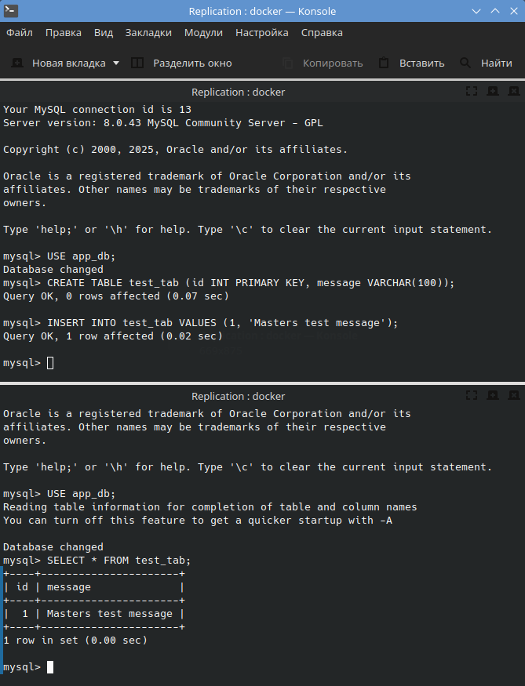
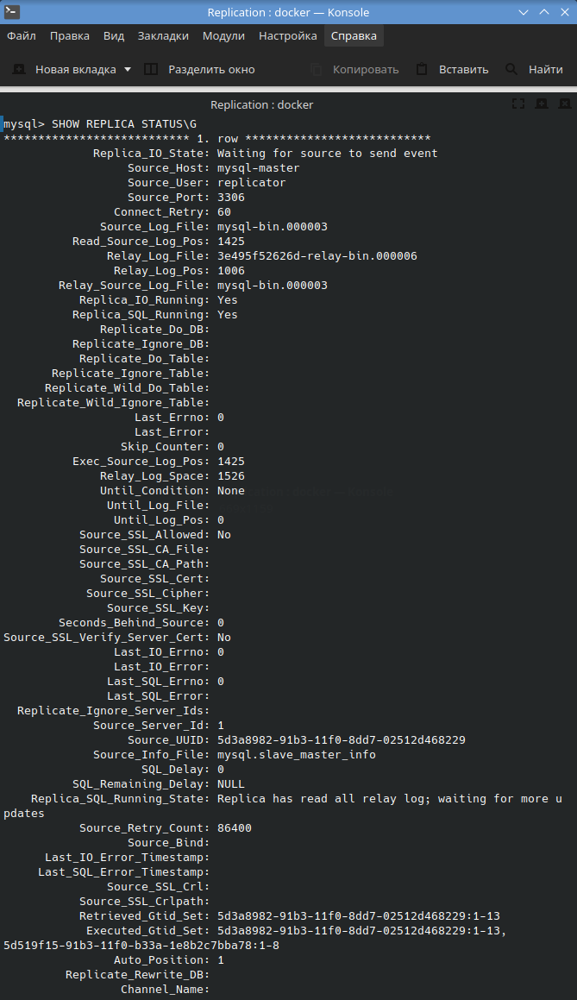
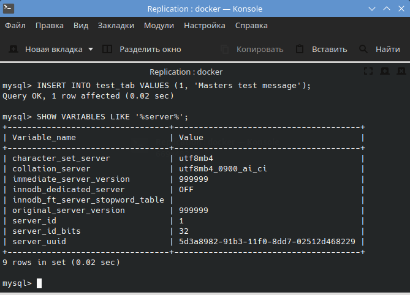
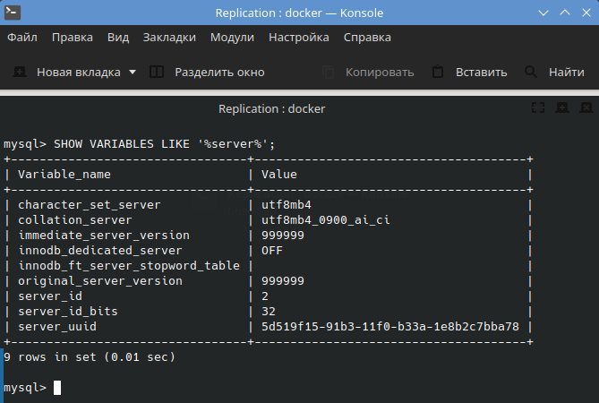
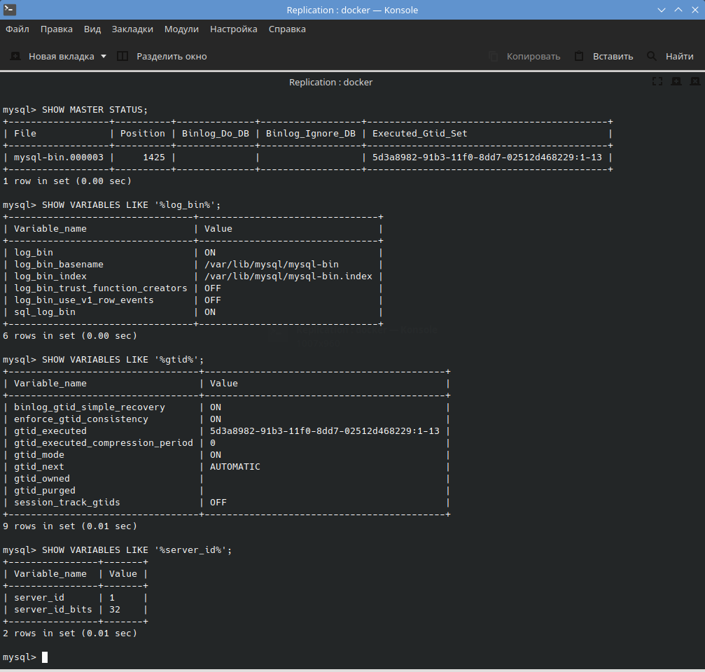
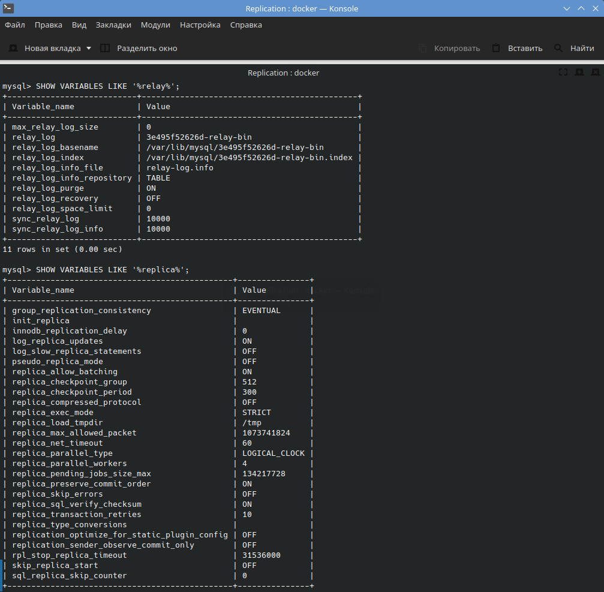
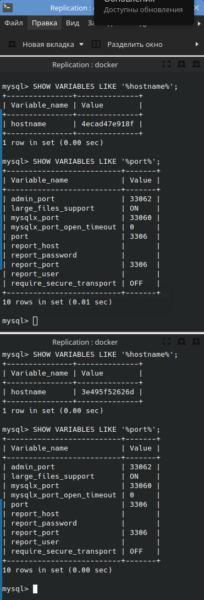
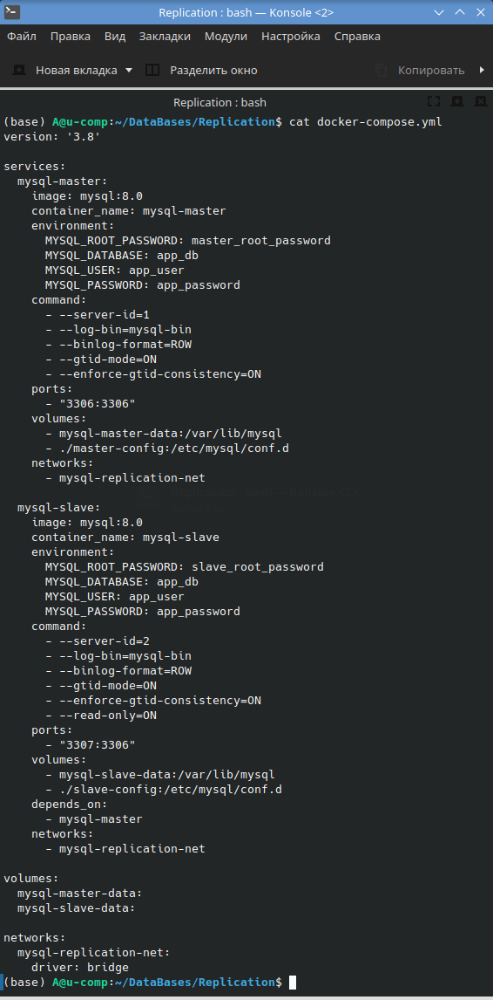

# Домашнее задание к занятию "`Репликация 1`" - `Болтунов Алексей`

---

### Задание 1

`Приведите ответ в свободной форме........`

Master-Slave (один главный, один/много подчиненных):

Запись только на мастер, чтение со всех. Простая настройка, нет конфликтов данных. Идеально для разделения нагрузки: мастер для записи, слейвы для чтения.
Минус: мастер - единая точка отказа

Master-Master (взаимная репликация):

Запись на любой сервер, данные синхронизируются. Высшая доступность - нет единой точки отказа. Сложная настройка, возможны конфликты данных. 
Требует аккуратного проектирования приложений

Основное отличие: Master-Slave - однонаправленная репликация (только запись на мастер), Master-Master - двунаправленная (запись на любой сервер).

Master-Master - для высоконагруженных систем с высоким требованием отказоустойчивости.

---

### Задание 2

 
 
 
 
 
 
 

---

